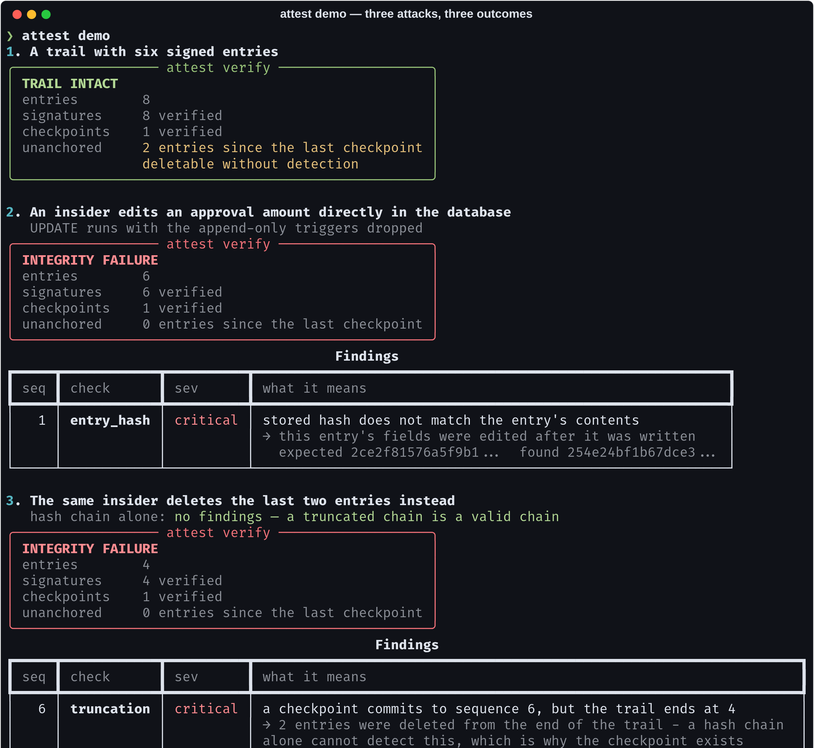
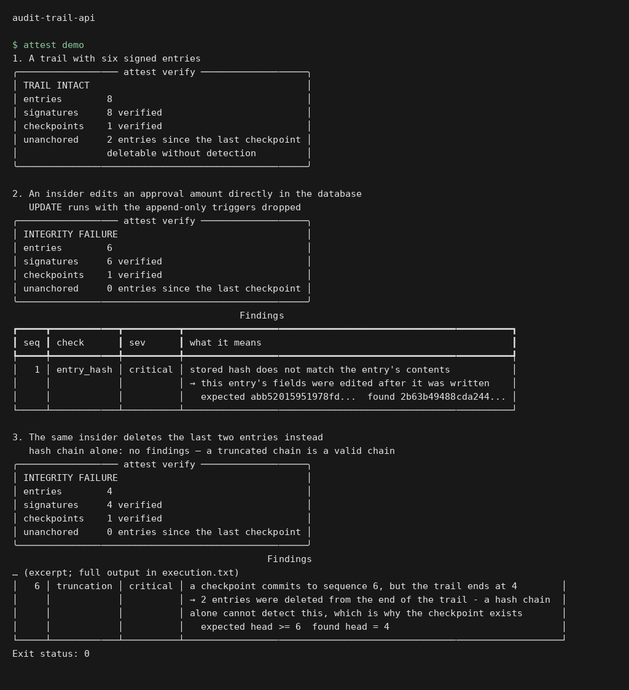
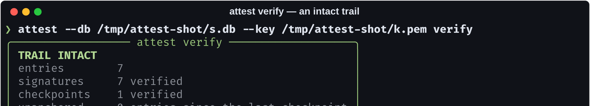
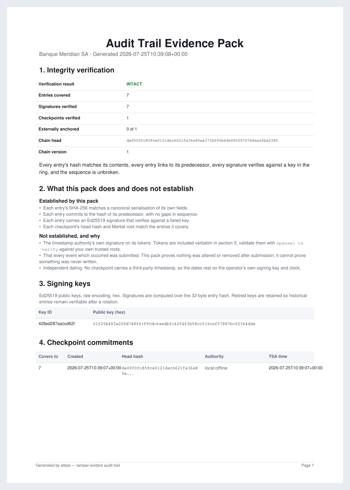

# attest — audit-trail-api

> A hash chain proves nobody edited your log. It cannot prove nobody **deleted
> the end of it** — and most "immutable audit log" projects never mention that.
> This one is built around it.

[](https://github.com/Vincent-P-essy/audit-trail-api/actions/workflows/ci.yml)
[](pyproject.toml)
[](tests)
[](src/attest/core/signing.py)
[](src/attest/core/rfc3161.py)
[](LICENSE)

A tamper-evident audit trail for regulated systems: every event hash-chained to
its predecessor, Ed25519-signed, periodically committed to an RFC 3161
timestamp authority, and exportable as an evidence pack a third party can check
**without trusting the system that produced it**.



## Execution preview



Local execution of `attest demo`. The input and output shown come from the repository example or test fixtures. [Verification](docs/verification.md).

## The problem this is actually solving

Hash-chained logs are a well-understood idea, and most implementations of it
share a hole they do not talk about.

Chain entry N to entry N−1 and editing any entry breaks every link after it.
Sign each entry and the attacker needs your key as well. Both are necessary.
Neither detects **truncation** — deleting the newest entries leaves a chain that
verifies perfectly, because it *is* a valid chain, just shorter. The evidence
those entries ever existed was inside the entries.

That is the shape of the realistic insider attack. Nobody rewrites an approval
they made three months ago; they delete the twenty minutes of activity around
the thing they did an hour ago.

The only defence is committing the chain head somewhere the operator does not
control. `attest` does that with signed checkpoints carrying RFC 3161 timestamp
tokens, reports the **unanchored window** — how many entries could be deleted
right now without detection — as a first-class number, and tells you plainly
when a checkpoint is not externally anchored.

```
$ attest verify
unanchored     14 entries since the last checkpoint
               deletable without detection
```

## What each layer buys you

| Layer | Detects | Blind to |
| --- | --- | --- |
| **Canonical hashing** | any edit to any field | nothing — but only if serialisation is deterministic (see below) |
| **Hash chain** | edits, reordering, deletion from the middle | deletion from the **end** |
| **Ed25519 signatures** | wholesale rewriting by anyone without the key | an attacker who has the key |
| **Signed checkpoints** | truncation back to the last checkpoint | the window since it |
| **RFC 3161 anchoring** | backdating by the operator themselves | — |

Verification runs all five and reports what each one found:



## Install and try it

```bash
git clone https://github.com/Vincent-P-essy/audit-trail-api
cd audit-trail-api
pip install -e .

attest demo      # builds a trail, then attacks it three ways
```

The demo is the fastest way to see the point: an edited entry is caught by its
own hash, a deleted middle entry by the sequence gap and a broken link, and a
truncated tail is **invisible to the chain alone** — then caught immediately
once a checkpoint covers it.

Everyday use:

```bash
attest init                                            # generate a signing key
attest append --actor m.dubois --action payment.approve \
              --resource PAY-88120 --payload '{"amount_cents": 1842000}'
attest checkpoint --tsa https://freetsa.org/tsr        # anchor to a real TSA
attest verify
attest export --out evidence-pack.pdf
attest serve                                           # the HTTP API
```

## Findings that name the culprit, not just the crime

A verifier that returns `false` invites "your tool must be buggy". Every finding
carries the sequence number, the expected and actual values, and what the
*combination* of failing checks implies:

| Symptom | What it means |
| --- | --- |
| hash mismatch at N | entry N's fields were edited |
| link break at N, N's own hash valid | entry N−1 was edited or removed |
| sequence gap | entries deleted from the middle |
| signature invalid | forged, or signed with a key outside the ring |
| head behind a checkpoint | the tail was truncated |

## The evidence pack



Section 2 is the part that makes it useful to a regulator. It states what the
document establishes *and what it does not* — including that the TSA's own
signature was not validated here, with the `openssl ts -verify` command to do
it independently, and that no audit trail can prove an event was never written
in the first place. A pack that says only "VERIFIED" is asking the reader to
trust the same system twice.

## Three details that are easy to get wrong

**Floats are rejected outright.** `0.1 + 0.2` does not round-trip through JSON
identically on every platform, and IEEE-754 repr rules have changed between
Python versions. A monetary amount stored as a float is a verification failure
waiting for a platform upgrade — one that will look exactly like tampering,
years later, in an audit. Amounts go in integer minor units or strings, and the
API returns 422 with a usable hint rather than accepting the problem.

**Append-only is a database property, not a convention.** SQLite triggers abort
any `UPDATE` or `DELETE`. That is defence in depth and *not* a boundary —
anyone with write access to the file can drop the triggers, which is exactly
what `force_mutate()` does so the tests and the demo can play the attacker. The
signature chain is what actually stops them.

**Merkle roots promote odd nodes rather than duplicating them.** Duplicating
the last node is [CVE-2012-2459](https://nvd.nist.gov/vuln/detail/CVE-2012-2459):
two different leaf sets produce the same root. There is a test for it.

## HTTP API

| Method | Path | Notes |
| --- | --- | --- |
| `POST` | `/v1/events` | append; 422 on a non-canonicalisable payload |
| `GET` | `/v1/events` | filter by actor, action, resource, time range |
| `GET` | `/v1/events/<seq>` | one entry |
| `GET` | `/v1/verify` | **409** when the trail is broken, so a status-code probe notices |
| `POST` | `/v1/checkpoints` | cut and anchor |
| `GET` | `/v1/checkpoints` | with `externally_anchored` per checkpoint |
| `GET` | `/v1/export/evidence.pdf` | the pack |
| `GET` | `/health` | includes the unanchored window |

There is no `PUT` and no `DELETE`, and no soft-delete flag either — a `deleted`
column would let the trail lie by omission while every hash still verified. A
correction is a new entry referencing the one it corrects. `DELETE` returns 405
with that explanation rather than a bare error.

Read and write tokens are separate: the service emitting events should not be
able to read the whole trail back, and the auditor reading it should not be able
to write.

## Tested against every attack it claims to detect

81 tests. The interesting ones are adversarial rather than functional:

- an edited entry, and a **thorough** attacker who also recomputes its hash
  (which fixes that check and breaks the next entry's link plus the signature)
- deletion from the middle, and truncation from the end — asserted **invisible**
  without a checkpoint, and caught with one
- a signature forged with another key, and one from a key outside the ring
- four threads appending concurrently, asserting no fork in the chain
- Merkle CVE-2012-2459 resistance
- DER encoding: signed-integer padding, long-form lengths, the SHA-256 OID
  byte-for-byte

CI additionally runs the tamper scenarios end to end through the CLI and fails
if `verify` does **not** report a broken trail — the claim is checked on every
push rather than asserted in this README.

## Where this stops

- **SQLite.** Fine for the volumes an audit trail sees; the storage layer is one
  class if you need Postgres.
- **The TSA's own signature is not validated in-process.** That needs a
  certificate chain and a trust store, which is a policy decision. Tokens are
  stored verbatim for independent validation.
- **Anchoring is only as good as its cadence.** The window between checkpoints
  is real exposure, which is why it is reported rather than hidden.
- **No trail can prove an event was never written.** This proves nothing was
  altered or removed *after* submission. Getting events submitted in the first
  place is the calling system's problem.

## Layout

```
src/attest/
  core/     canonical · chain · signing · store · verify · anchor · rfc3161
  api/      Flask service
  export/   regulator evidence pack (reportlab)
  cli.py    init · append · verify · checkpoint · export · serve · demo
```

## Licence

MIT
